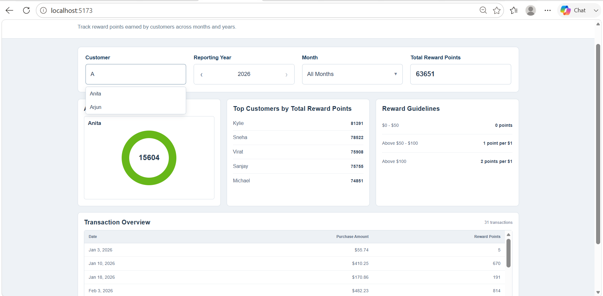
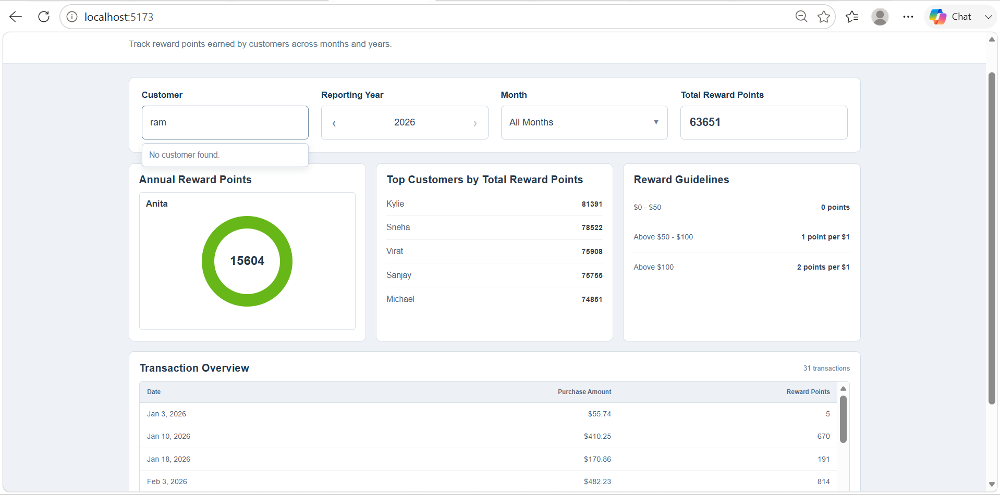
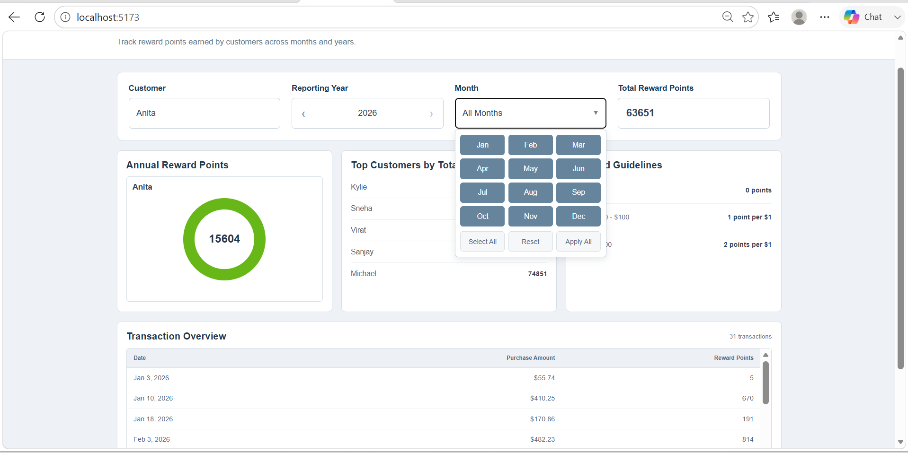
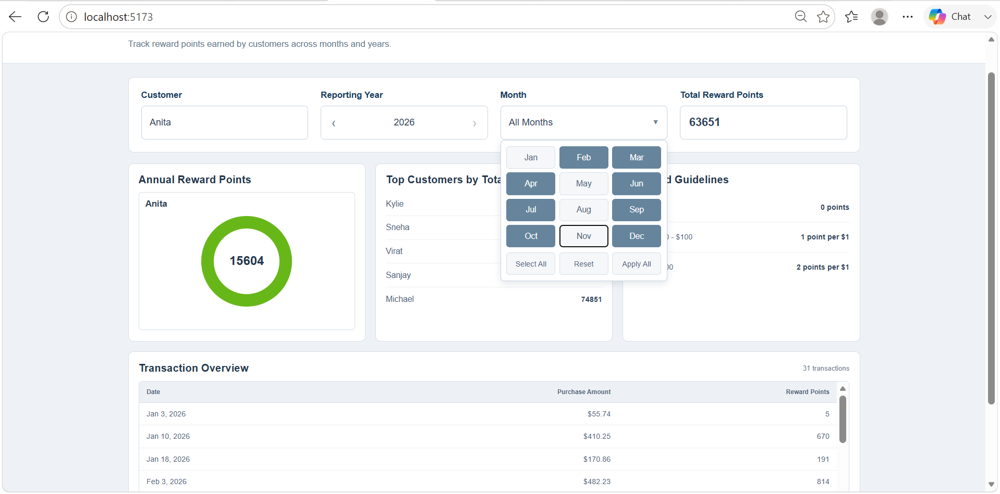
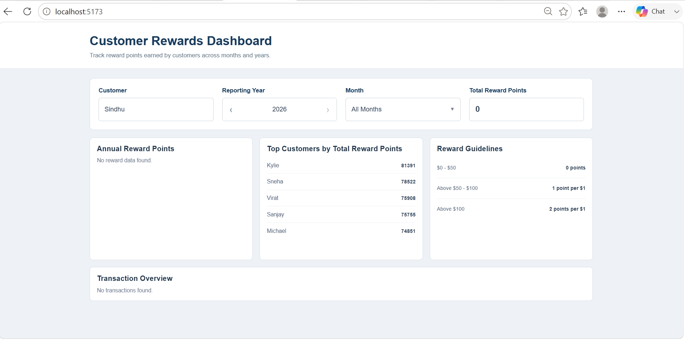
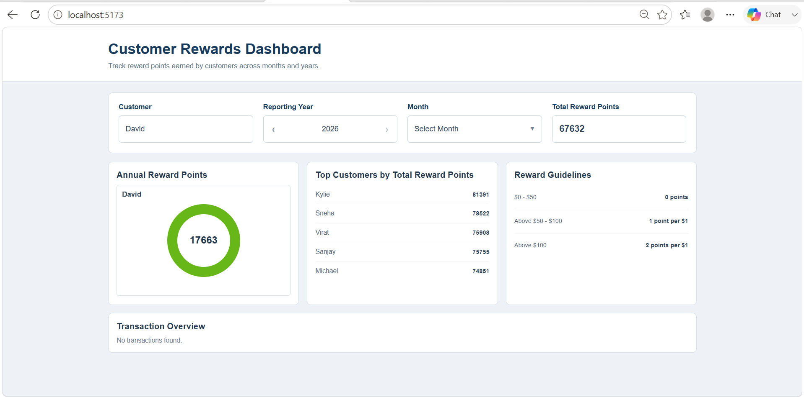
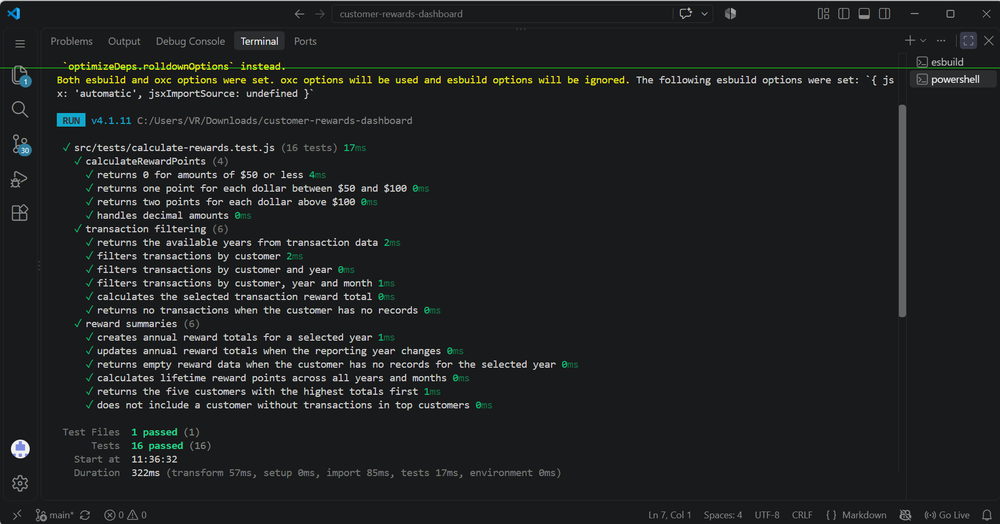

# Customer Rewards Program

A React application that calculates customer reward points from transaction data and provides a simple dashboard to view customer rewards by customer, reporting year, and month.

## Application Images








## Test Output



## Features

- Customer search with text input.
- Customer suggestions are displayed in alphabetical order.
- Customer search matches names from the beginning of the customer name.
- Five customer suggestions are visible at a time, with the remaining customers available through scrolling.
- `No customer found.` is displayed when no customer matches the entered text.
- Selecting a customer updates the Customer field.
- The customer list does not contain an All Customers option.
- Customer 16, Sindhu, is available in the customer list without transaction records for empty-data testing.
- Reporting Year is populated from the available transaction data.
- Previous and next controls allow navigation through the available reporting years.
- The previous year control is disabled at the first available year.
- The next year control is disabled at the last available year.
- The year control does not contain an All Years option.
- Month selection supports January through December.
- Multiple months can be selected at the same time.
- Select All allows all available months to be selected.
- Reset clears the current month selections.
- Apply All applies the selected months to the transaction filter.
- Changing the selected months updates the transaction details for the selected customer and reporting year.
- Reward points are calculated according to the assignment rules.
- Reward Points Summary displays the selected customer's annual reward points for the selected reporting year.
- Annual reward points are displayed inside a circular status indicator.
- Changing the reporting year updates the annual reward points.
- Total Reward Points represents the selected customer's reward points across all available years and months.
- Changing the selected months does not change the customer's lifetime total.
- Changing the reporting year does not change the customer's lifetime total.
- Changing the customer updates the lifetime total.
- Top Reward Earners displays the five customers with the highest total reward points.
- Top Reward Earners uses transaction data from all available years and months.
- Top Reward Earners are displayed from highest reward points to lowest reward points.
- The Top Reward Earners list is read-only.
- Customer names are displayed fully without unnecessary truncation.
- Transaction details display Date, Purchase Amount, and Reward Points.
- The transaction table has a scrollable area with a sticky header.
- The Calculation column is not displayed.
- No unnecessary serial-number column is displayed.
- Transaction data is loaded through a simulated asynchronous service.
- Loading failures are handled without crashing the application.
- Customers without transaction records can be selected and display the appropriate empty states.
- No external API or backend service is required.

## Reward Calculation

Reward points are calculated for each transaction using the following rules:

- Purchase amount of $50 or less = 0 points.
- Purchase amount above $50 and up to $100 = 1 point for each dollar above $50.
- Purchase amount above $100 = 50 points for the first $50 above $50, plus 2 points for each dollar above $100.

### Examples

- $50 = 0 points
- $75 = 25 points
- $100 = 50 points
- $101 = 52 points
- $120 = 90 points
- $150 = 150 points
- $75.50 = 25 points
- $120.75 = 91 points

Decimal purchase amounts are supported and included in the test coverage.

## Filters

The application provides Customer, Reporting Year, and Month filters.

### Customer

- The Customer field supports text input.
- The initial customer field displays `Enter Name Here...`.
- Customer suggestions are displayed alphabetically.
- Entering the first letter shows matching customer names.
- Entering the first few letters shows customer names that start with the entered text.
- Five customer suggestions are visible at a time.
- The remaining customer suggestions can be accessed by scrolling.
- An invalid customer name displays `No customer found.`.
- Selecting a customer updates the Customer field.
- The customer list does not contain an All Customers option.
- Customer 16, Sindhu, has no transaction records and is used to verify the empty-data state.

### Reporting Year

- Reporting years are taken from the transaction data.
- The available reporting years are 2023, 2024, 2025, and 2026.
- Previous and next controls allow the user to move between available years.
- Previous is disabled for the first available year.
- Next is disabled for the last available year.
- The Reporting Year control does not contain an All Years option.

### Month

- Month selection includes January through December.
- The month control supports selecting multiple months.
- Multiple months can be selected together to view transactions for more than one month.
- Select All selects all available months.
- Reset clears the currently selected months.
- Apply All applies the selected month values to the transaction filter.
- Changing the selected months updates the transaction details for the selected customer and reporting year.
- The month filter does not change the customer's lifetime Total Reward Points.

## Reward Points Summary

The Reward Points Summary displays the selected customer's annual reward points for the selected reporting year.

- Annual reward points are calculated using all transactions for the selected customer in the selected reporting year.
- The annual reward value is displayed inside a circular status indicator.
- Changing the reporting year updates the annual reward total.
- The annual reward total is independent of the selected month filter.
- The summary does not display separate January through December columns.
- If the selected customer has no transactions for the selected reporting year, the annual reward section displays `No reward data found.`.

## Total Reward Points

Total Reward Points represents the selected customer's reward points across the complete transaction data.

- Selecting a customer updates the lifetime total.
- The total includes all available reporting years and months.
- Changing the reporting year does not change the lifetime total.
- Changing the selected months does not change the lifetime total.
- Changing the customer updates the lifetime total.
- A customer without transactions, such as Sindhu, has a lifetime total of 0.

## Top Reward Earners

The Top Reward Earners section shows the five customers with the highest total reward points.

- All available transaction data is used.
- Reward points from all available years and months are included.
- Customers are sorted from highest reward points to lowest reward points.
- Only the top five customers are displayed.
- The list is read-only.
- Customers without transaction records are not included in the Top Reward Earners list.
- The list does not contain a serial-number column.

## Transaction Details

The Transaction Details section displays transactions for the selected customer, reporting year, and selected months.

The table contains only:

- Date
- Purchase Amount
- Reward Points

The transaction table has:

- A scrollable transaction area.
- A sticky table header.
- No Calculation column.
- No unnecessary serial-number column.
- An empty state displaying `No transactions found.` when there are no matching transactions.

When multiple months are selected, the transaction list contains transactions matching any of the selected months for the selected customer and reporting year.

## Empty Customer Data

Customer 16 is maintained separately from the transaction dataset:

- Customer ID: `16`
- Customer Name: `Sindhu`
- Transactions: `0`
- Lifetime Reward Points: `0`

Sindhu is included in the Customer selector so the application can be tested with a customer who has no transaction records.

Selecting Sindhu displays:

```text
Total Reward Points
0